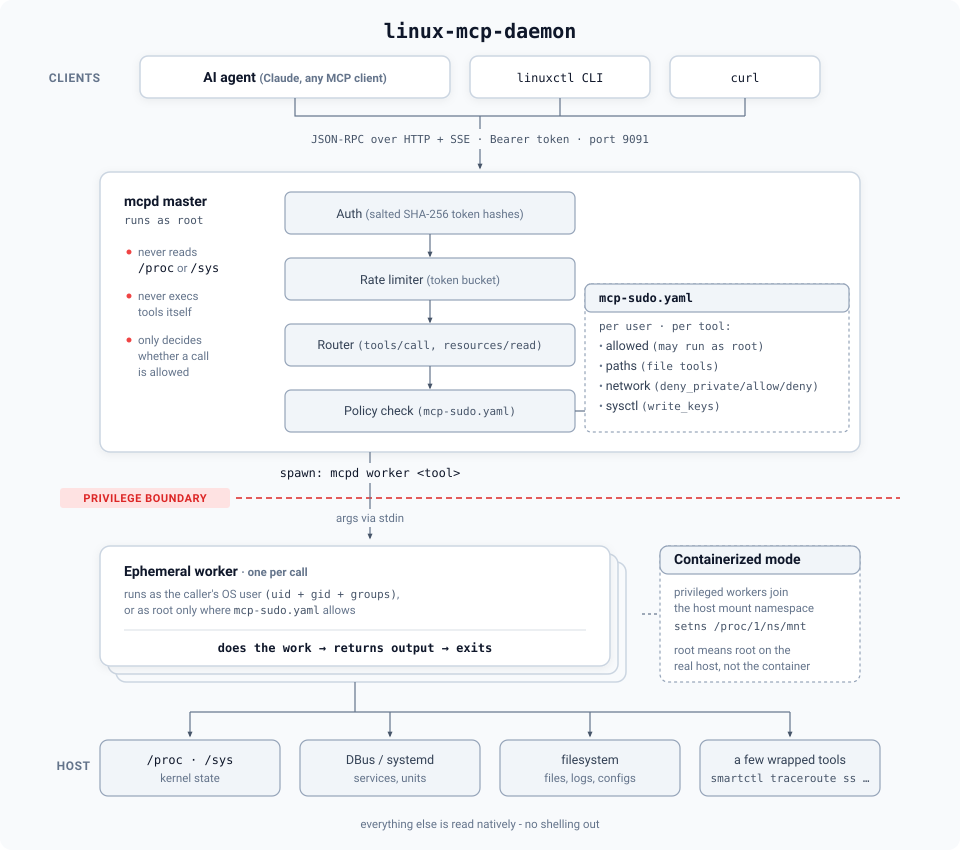

# Linux MCPd

[](https://nucleusv.github.io/linux-mcp-daemon/)
[](https://github.com/nucleusv/linux-mcp-daemon/releases)
[](LICENSE)

A high-performance, Go-based Model Context Protocol (MCP) daemon (`mcpd`) designed to securely bridge AI agents directly with the Linux operating system.

## Overview

This project implements a zero-dependency (kernel-first) philosophy. It allows AI agents to introspect and interact with the host Linux system directly via raw syscalls and the Virtual File System (`/proc`, `/sys`) without requiring bloated third-party parsing libraries.

Communication happens directly between the AI agent and the daemon via HTTP Server-Sent Events (SSE) and JSON-RPC over port 9091.

## How It Works

<p align="center">
  
</p>

- **Every tool/resource call spawns a fresh worker process and exits.** There's no long-lived state per call - `internal/worker/spawner.go` re-execs the `mcpd` binary itself in `worker` mode (arguments on stdin, never argv), with `syscall.Credential{Uid, Gid, Groups}` set to a real OS account resolved via `user.Lookup()`. This is the actual privilege isolation, not a config flag: an unprivileged user's worker process is a genuinely different Linux UID than a privileged one's.
- **`configs/mcp-sudo.yaml` decides, per user and per tool, whether `privileged: true` is honored.** Two grants exist for resources specifically (see `ARCHITECTURE.md`'s gotcha section) - one for the resource URI itself, one for the internal worker tool name behind it.
- **When `mcpd` runs containerized** (`configs/daemon.yaml`'s `worker.containerized: true`, this project's actual Kubernetes deployment), a privileged worker also joins the real host's mount namespace (`setns(CLONE_NEWNS)` on `/proc/1/ns/mnt`, no external `nsenter` binary) - so `privileged: true` means root on the real host, not just root inside the daemon's own container image.
- **Bearer tokens are salted+hashed** in `users.yaml` (`token_salt` + `token_hash`, `sha256`, constant-time compared; the file is `0600`), not stored in plaintext. Users and grants are edited only locally, on the host, via `linuxctl <verb> mcpd user` and `linuxctl edit mcpd config` (validated like `visudo`) - there is no MCP tool that edits them, so nothing with just a bearer token can grant itself anything. The running daemon applies changes without a restart through `daemon/reload-config`, which only re-reads the files and rejects invalid ones (see [Daemon User Administration](docs/website/docs/linuxctl/mcpd-admin.md)).
- **Every read is schema-driven, not hand-listed.** `linuxctl` fetches `tools/list`/`resources/list`/`resources/templates/list` from the live daemon on every invocation and resolves its `<verb> <group> [keyword]` grammar against that - a new tool added server-side is immediately usable client-side with zero code changes (see [`plan/linuxctl-redesign.md`](plan/linuxctl-redesign.md)).

## Features

- **Direct AI Interaction:** HTTP/SSE transport for immediate agent-to-daemon communication.
- **Strict Security:** Rate limiting, salted+hashed Bearer token authentication, and directory traversal protection.
- **Privilege Separation:** Master daemon runs as root, spinning up ephemeral unprivileged/privileged workers based on rules defined in `configs/mcp-sudo.yaml`.
- **High Performance:** Uses `singleflight` deduplication and TTL caching for efficient system introspection.
- **Docker & Kubernetes Ready:** Fully containerized with a multi-stage Docker build and Kubernetes deployment manifests that allow safe host introspection.

## Get started

### Install on Linux (systemd)

```bash
curl -fsSL https://raw.githubusercontent.com/nucleusv/linux-mcp-daemon/main/scripts/install.sh | sudo bash
```

Needs `sudo` and `curl` on an amd64/arm64 host (in a bare `ubuntu`/`debian` container: `apt update && apt install -y curl ca-certificates`, then pipe to `bash` as root). This downloads the latest release for your architecture (amd64/arm64), **verifies its sha256 checksum**, installs `mcpd` and `linuxctl` to `/usr/local/bin`, writes clean configs to `/etc/mcpd/configs` (no default users or tokens), creates a first user `mcp` and **prints its token once**, and starts the `mcpd` systemd service. Then:

```bash
export MCP_SERVER=http://127.0.0.1:9091
export MCP_TOKEN=<token printed by the installer>
linuxctl get system os-release
linuxctl get processes top
```

- **Upgrade:** run the same command again - configs are kept, the service restarts only if `mcpd` changed. From v0.1.0, grant your first user `daemon/reload-config` once - see [Upgrading](https://nucleusv.github.io/linux-mcp-daemon/installation/#upgrading).
- **Pin a version / name the user:** `... | sudo bash -s -- --version v0.1.0 --user alice`
- **More users:** each needs an OS account of the same name - see [Adding more users](https://nucleusv.github.io/linux-mcp-daemon/installation/#adding-more-users).
- **Uninstall:** `... | sudo bash -s -- --uninstall` (add `--purge` to delete `/etc/mcpd`; the `mcp` OS account stays - `sudo userdel -r mcp`)
- **Container image:** `ghcr.io/nucleusv/linux-mcp-daemon` (amd64/arm64) - setup steps in the [installation docs](https://nucleusv.github.io/linux-mcp-daemon/installation/).
- **macOS (CLI only):** the same script installs just `linuxctl` - `curl -fsSL .../install.sh | bash -s -- --bin-dir ~/.local/bin`, then `export PATH="$HOME/.local/bin:$PATH"` (not on macOS's default PATH) - to drive a remote mcpd.

> mcpd listens on all interfaces over plain HTTP unless TLS is enabled in `daemon.yaml`. Firewall port 9091 to trusted addresses, or enable TLS, before exposing it. Root access for tools is granted per user and per tool in `mcp-sudo.yaml`.

Full guide: [Installation](https://nucleusv.github.io/linux-mcp-daemon/installation/) · [Connect an AI agent](https://nucleusv.github.io/linux-mcp-daemon/ai-agent-configuration/) · [mcp-sudo.yaml](https://nucleusv.github.io/linux-mcp-daemon/configuration/mcp-sudo/)

## Development: build from source

### 1. Build and Deploy the Server (`mcpd`)

1. Build the Docker image:
   ```bash
   ./scripts/build.sh
   ```

2. Deploy to your local Kubernetes cluster:
   ```bash
   ./scripts/deploy.sh
   ```

### 2. Build the Client (`linuxctl`)

You can build the CLI client directly on your host machine (e.g. macOS):

```bash
./scripts/build-cli.sh
```

### 3. Usage (local development)

The daemon runs on port `9091`. You can connect via your AI client using SSE, or use the `linuxctl` CLI tool:

```bash
# Set your token as an environment variable
export MCP_TOKEN="your_token_here"

# Ping the daemon
./executables/linuxctl ping
```

`linuxctl` speaks a small verb/group grammar (`linuxctl <verb> <group> [target-keyword] [args]`, design in [`plan/linuxctl-redesign.md`](plan/linuxctl-redesign.md)) and dynamically discovers every tool and resource from the running daemon - there's no separate client-side command list to keep in sync. Full reference: [linuxctl docs](docs/website/docs/linuxctl/overview.md) or `man linuxctl`. Every example below shows both forms: `linuxctl`, and the raw MCP JSON-RPC `curl` call it resolves to - the full per-tool/resource reference with these side by side for every single one lives at [MCP API docs](docs/website/docs/mcp-api/overview.md).

### Calling the API directly with curl

`mcpd` speaks JSON-RPC 2.0 over HTTP + SSE, not plain request/response HTTP - every call is a two-step handshake: open an SSE stream to get a one-time POST endpoint, then POST the JSON-RPC request there (the actual result streams back on the SSE connection, not in the POST's response body):

```bash
# 1. Open the SSE stream in the background and capture the endpoint it prints
curl -N -s -H "Authorization: Bearer $MCP_TOKEN" http://localhost:9091/sse &
# server sends: event: endpoint / data: /message?session_id=...

# 2. POST a request to that endpoint
curl -s -X POST "http://localhost:9091/message?session_id=<from step 1>" \
  -H "Authorization: Bearer $MCP_TOKEN" \
  -H "Content-Type: application/json" \
  -d '{"jsonrpc": "2.0", "id": "1", "method": "tools/list"}'

# 3. Watch the SSE stream from step 1 for the matching "id": "1" response
```

Every example below follows this exact pattern - only the `-d` payload changes.

### Files

```bash
# List a directory, as a table (get is the sole read verb - one result or many, same as kubectl)
$ ./executables/linuxctl get files list /var/log --output table
MODIFIED              NAME               SIZE     IS_DIR
2026-09-22 18:38:14   alternatives.log   6522     false
2026-09-22 18:38:10   apt                4096     true
...
```
```bash
curl -s -X POST "$ENDPOINT" -H "Authorization: Bearer $MCP_TOKEN" -H "Content-Type: application/json" \
  -d '{"jsonrpc":"2.0","id":"1","method":"tools/call","params":{"name":"files/list","arguments":{"path":"/var/log","output_format":"table"}}}'
```

```bash
# Read a single file's contents (bare - no keyword needed, files' only other read candidate)
./executables/linuxctl get files /etc/hosts
```
```bash
curl -s -X POST "$ENDPOINT" -H "Authorization: Bearer $MCP_TOKEN" -H "Content-Type: application/json" \
  -d '{"jsonrpc":"2.0","id":"1","method":"tools/call","params":{"name":"files/read","arguments":{"path":"/etc/hosts"}}}'
```

### Resources (direct by URI)

```bash
# Read a static resource directly by URI (resource URIs always use scheme://path)
$ ./executables/linuxctl resource os://uname
Sysname: Linux
Nodename: desktop-control-plane
Release: 7.0.12-linuxkit
...
```
```bash
curl -s -X POST "$ENDPOINT" -H "Authorization: Bearer $MCP_TOKEN" -H "Content-Type: application/json" \
  -d '{"jsonrpc":"2.0","id":"1","method":"resources/read","params":{"uri":"os://uname"}}'
```

### Disks

```bash
# Native partition geometry - parsed from /sys/class/block, no fdisk dependency
./executables/linuxctl get disks partitions vda --output json
```
```bash
curl -s -X POST "$ENDPOINT" -H "Authorization: Bearer $MCP_TOKEN" -H "Content-Type: application/json" \
  -d '{"jsonrpc":"2.0","id":"1","method":"tools/call","params":{"name":"disks/partitions","arguments":{"device":"vda","output_format":"json"}}}'
```

```bash
# Run a privileged tool (requires a root rule in configs/mcp-sudo.yaml)
./executables/linuxctl get disks free / --privileged true
```
```bash
curl -s -X POST "$ENDPOINT" -H "Authorization: Bearer $MCP_TOKEN" -H "Content-Type: application/json" \
  -d '{"jsonrpc":"2.0","id":"1","method":"tools/call","params":{"name":"disks/free","arguments":{"path":"/","privileged":true}}}'
```

### Processes: one result vs many, and rich detail

```bash
# Same underlying tool - bare form lists many, a specific PID filters to one
./executables/linuxctl get processes --sort_by mem --limit 5
./executables/linuxctl get processes 1234
```
```bash
curl -s -X POST "$ENDPOINT" -H "Authorization: Bearer $MCP_TOKEN" -H "Content-Type: application/json" \
  -d '{"jsonrpc":"2.0","id":"1","method":"tools/call","params":{"name":"processes/list","arguments":{"pid":1234}}}'
```

```bash
# Rich aggregated detail (combines several reads, excludes secret-shaped data like environ)
./executables/linuxctl describe processes 1234
```
```bash
# describe aggregates multiple resources/read calls client-side - e.g. one of them:
curl -s -X POST "$ENDPOINT" -H "Authorization: Bearer $MCP_TOKEN" -H "Content-Type: application/json" \
  -d '{"jsonrpc":"2.0","id":"1","method":"resources/read","params":{"uri":"process://1234/status"}}'
```

### Logs (host-only tool, requires `privileged: true` in containerized deployments)

```bash
# journalctl only exists on the host, never in this daemon's own image
./executables/linuxctl get logs journal --unit kubelet.service --boot true --privileged true
```
```bash
curl -s -X POST "$ENDPOINT" -H "Authorization: Bearer $MCP_TOKEN" -H "Content-Type: application/json" \
  -d '{"jsonrpc":"2.0","id":"1","method":"tools/call","params":{"name":"logs/journal-control","arguments":{"unit":"kubelet.service","boot":true,"privileged":true}}}'
```

### Mutations (services, kernel)

```bash
./executables/linuxctl restart system services nginx.service --privileged true
./executables/linuxctl update  kernel sysctl net.ipv4.ip_forward 1 --privileged true
```
```bash
curl -s -X POST "$ENDPOINT" -H "Authorization: Bearer $MCP_TOKEN" -H "Content-Type: application/json" \
  -d '{"jsonrpc":"2.0","id":"1","method":"tools/call","params":{"name":"services/manage","arguments":{"service":"nginx.service","action":"restart","privileged":true}}}'
```

### Introspecting the MCP protocol itself

```bash
./executables/linuxctl get mcp-api info      # raw initialize response: protocol version + declared capabilities
./executables/linuxctl get mcp-api tools     # every tool, by literal name
./executables/linuxctl get mcp-api resources # every static resource + template
./executables/linuxctl get mcp-api prompts   # reports plainly that mcpd doesn't implement this MCP capability
```
```bash
curl -s -X POST "$ENDPOINT" -H "Authorization: Bearer $MCP_TOKEN" -H "Content-Type: application/json" \
  -d '{"jsonrpc":"2.0","id":"1","method":"initialize","params":{"protocolVersion":"2024-11-05","capabilities":{},"clientInfo":{"name":"curl","version":"1.0"}}}'
```

### Direct-by-name escape hatches (bypassing the verb grammar)

```bash
./executables/linuxctl tool files/list --path /tmp   # symmetric with `resource <uri>` above
```
```bash
curl -s -X POST "$ENDPOINT" -H "Authorization: Bearer $MCP_TOKEN" -H "Content-Type: application/json" \
  -d '{"jsonrpc":"2.0","id":"1","method":"tools/call","params":{"name":"files/list","arguments":{"path":"/tmp"}}}'
```

### Daemon user/token administration (local-only, no network call at all)

```bash
./executables/linuxctl create mcpd user alice   # generates a token, prints it once, writes to configs/*.yaml directly
./executables/linuxctl list mcpd users
```
There's no curl equivalent for this group - see [Daemon User Administration](docs/website/docs/linuxctl/mcpd-admin.md) for why it's deliberately kept off the network entirely.

## Project Structure

- `cmd/mcpd/`: Main server application entrypoint.
- `cmd/linuxctl/`: The CLI client application.
- `configs/`: Configuration files (Daemon config, Sudo rules).
- `internal/`: Encapsulated business logic:
  - `auth/`: Authentication, authorization, rate limiting.
  - `fs/`: Safe, atomic file system operations.
  - `kernel/`: Raw parsing of `/proc` and `/sys`.
  - `mcpcore/`: Core routing and caching logic.
- `k8s/`: Kubernetes deployment manifests.
- `scripts/`: Build and deployment automation.

## License

This project is licensed under the MIT License.

## Releases

Pushing a SemVer tag (`git tag -a v0.1.0 -m v0.1.0 && git push origin v0.1.0`) runs [`.github/workflows/release.yml`](.github/workflows/release.yml): tests, then [GoReleaser](.goreleaser.yaml) publishes per-platform archives, `checksums.txt` and a changelog to GitHub Releases, and a multi-arch image to `ghcr.io/nucleusv/linux-mcp-daemon`.

## License

[Apache License 2.0](LICENSE) - see also [NOTICE](NOTICE).
